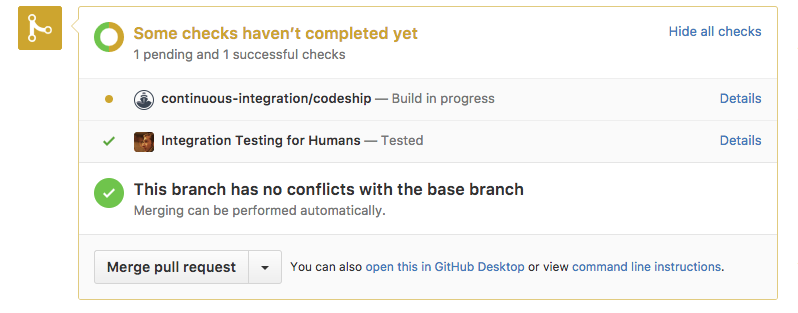

# integration-testing-for-humans

This package reminds you to run manual tests when you open or update a GitHub pull request.

If you are horrified at the idea of doing anything manually, let alone something so boring as testing,
may I suggest [you might be more horrified by Selenium](#why-not-selenium)?

## How it works

The package uses the GitHub [commit status API](https://github.com/blog/1227-commit-status-api)
to prompt you to test when you open or update a PR:


When you click "Details", you are shown exactly what you should test.


After doing so, you click the button:


And can merge the PR:



## Installation

This project exports Express middleware to mount into an existing server. It also defines a standalone
server to be run from the command line. If you'd like to use the middleware, or run the server
from a [package script](http://blog.npmjs.org/post/118810260230/building-a-simple-command-line-tool-with-npm),
run:

```sh
yarn add integration-testing-for-humans
```
or
```sh
npm install integration-testing-for-humans --save
```

If you'd like to install the standalone server globally:

```sh
yarn global add integration-testing-for-humans
```
or
```sh
npm install integration-testing-for-humans -g
```

## Usage

First, decide where you'd like to serve this package from, let's say "https://example.com/humans".
Then, take that path + "/events" ("https://example.com/humans/events") and register it as a webhook
for each repo whose pull requests you wish to test. Select "Pull request" events to be sent to the
webhook.

Then start the server. Using the middleware:

```js
var bodyParser = require('body-parser');
var conditional = require('express-conditional-middleware');
var express = require('express');
var humans = require('integration-testing-for-humans');
var app = express();

var middleware = humans({
  // A GitHub access token. Must have the `repo:status` OAuth scope.
  githubAccessToken: '...',
  // The secret you specified for the webhook. If you want to monitor multiple repos just use the
  // same secret for the webhook for each repo.
  githubWebhookSecret: '...',
  // The full location (origin + path) of the middleware e.g. "https://example.com/humans".
  location: 'https://example.com/humans',
  // The name of the default test to run on staging before merging. Optional.
  defaultTest: 'Send an email',
  // The name of a branch. If specified, only PRs targeting this branch will be monitored by this
  // middleware.
  mergeBranch: 'master-production'
});

// The middleware is an event emitter. You should register an 'error' listener to respond to errors
// arising from the GitHub API, since they will be emitted outside the Express request lifecycle.
// If you don't register a listener, any errors will be thrown to the run loop and crash the server!
middleware.on('error', (err) => console.error(err));

// If you want to use the JSON body parser, don't run it on the webhook route since the webhook
// parser uses the raw data.
app.use(conditional(
  (req) => req.url !== '/humans/events',
  bodyParser.json()
));

app.use('/humans', middleware);

app.listen(process.env.PORT);
```

The standalone server takes all the same arguments plus the port to run on. The GitHub access token
and webhook secret can be specified as environment variables. The binary is called `humans`, so
assuming you've installed the package globally, run:

```sh
ITFH_GITHUB_ACCESS_TOKEN="..." ITFH_GITHUB_WEBHOOK_SECRET="..." humans --location="https://example.com" --port=3000
```

Invoke `humans -h` to see all arguments.

Once you've got the server running, just open a PR against the repo for which you configured the
webhook. You'll then see the server tag the commit as needing testing (see [How it works](#how-it-works)). Click the "Details" link and click "I have tested" to unblock merging.

## FAQ

### Why not Selenium?

Humans are bad at writing Selenium tests. They're slow to write them and invariably fail to keep them
up-to-date. To be fair, this is only partly humans' fault, given that automated integration tests
are coupled to all sorts of implementation details (e.g. CSS selectors) that a human tester would
gloss right over. So, for products and engineering teams of a certain scale, it makes sense to have
the humans test instead.

### Ugh but manual testing will take a long time and people will forget things!

Indeed. As your test plan gets longer and more complex it will become more painful for you to run the
tests yourselves than to bite the bullet and automate them. We suggest that you manually run only the
simplest and most important tests, what are sometimes called
<a href="https://en.wikipedia.org/wiki/Smoke_testing_(software)">smoke tests</a>. When you need to test everything, because you can't afford to ship even small bugs, that's when to invest in Selenium.

And even then, you still might want to have a human do a final spot-check before deploying, in case the automation has broken.

## Contributing / Roadmap

We plan for this package to remain [pretty simple](#ugh-but-manual-testing-will-take-a-long-time-and-people-will-forget-things-), but we welcome pull requests! Please lint your code.

One idea that we probably will do is make it possible to specify more than one test to run, and
repo-specific tests, in a per-repo `manual_tests.md` file. The middleware will then iframe this file,
if present, into the "Details" page.

## Thanks

Loosely based on https://developer.github.com/guides/building-a-ci-server/.

## Changelog

* 1.0.2 README fixes
* 1.0.1 Fix miscellanous bugs
* 1.0.0 Initial version
